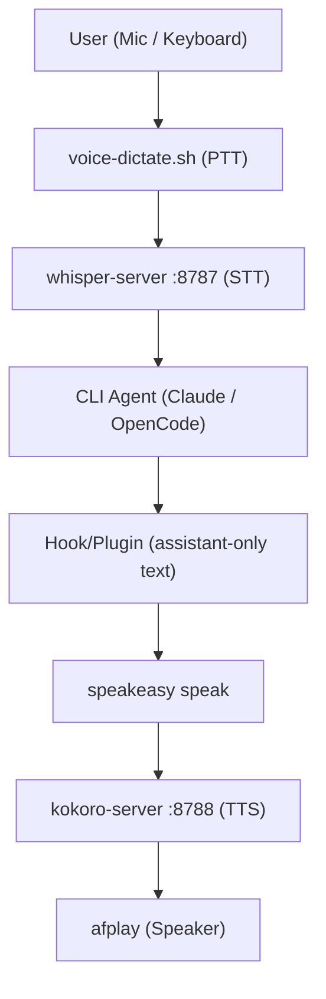

# SpeakEasy 🍸

**SpeakEasy** is a universal, 100% local voice interface for CLI agents and terminal workflows. It provides a seamless bridge between your voice and your local LLM agents (like Claude Code, Ollama, etc.) without ever sending audio or text data to the cloud.

The architecture uses "warm" background servers to keep transcription (STT) and speech (TTS) models in memory, enabling near-instant response times.

## 🧭 Architecture



---

## 🚀 Features

- **Local STT**: GPU-accelerated Whisper transcription via `whisper.cpp` (Metal support).
- **Local TTS**: High-quality neural voice generation via `kokoro-onnx` (ONNX runtime).
- **Zero Latency Loop**: Warm HTTP servers eliminate model load times (zero "cold start").
- **Pipelined Streaming**: Starts speaking the first sentence of a response in ~1.5s while the rest of the audio generates in the background.
- **Push-to-Talk**: Global Raycast hotkey for dictation into any application.
- **Smart Formatting**: Automatically strips code blocks and markdown from agent responses before speaking.
- **Project-Aware Voices**: Assigns unique voices to different project directories (know which agent is talking).
- **Private & Secure**: No API keys required. No telemetry. 100% offline.

---

## 🛠 Requirements

- **macOS**: Optimized for Apple Silicon (M1/M2/M3/M4) for Metal acceleration.
- **Homebrew**: For system dependencies.
- **uv**: For Python dependency management.
- **Hardware**: 
  - Recommended: 16GB+ RAM (Whisper + Kokoro use ~1.5GB total).
  - Audio: Built-in microphone or external USB interface.

---

## 📦 Installation

1. **Clone & Link**:
   ```bash
   git clone https://github.com/YOUR_USERNAME/speakeasy.git
   cd speakeasy
   chmod +x speakeasy voice-dictate.sh voice-mute-toggle.sh
   ln -sf "$(pwd)/speakeasy" ~/.local/bin/speakeasy
   ```

2. **Run Setup**:
   This installs `sox`, `ffmpeg`, `jq`, `whisper-cpp`, and `espeak-ng`, and downloads the models (~900MB).
   ```bash
   speakeasy setup
   ```

3. **Start Servers**:
   ```bash
   speakeasy server start
   ```

4. **Install Agent Hooks**:
   ```bash
   speakeasy hook-install claude
   speakeasy hook-install opencode
   ```

---

## ⌨️ Raycast Hotkeys

To enable the push-to-talk experience:
1. Open Raycast > Settings > Extensions > **Script Commands**.
2. Click **Add Script Directory** and select the `speakeasy` folder.
3. Assign Hotkeys:
   - **SpeakEasy Dictate**: `Cmd + Opt + L` (Recommended)
   - **SpeakEasy Mute Toggle**: `Cmd + Opt + M`

---

## ⚙️ Configuration

Settings are stored in `~/.config/speakeasy/config`.

### Agent Integrations

- **Claude Code**:
  ```bash
  speakeasy hook-install claude
  ```
  This writes hook scripts to `~/.config/speakeasy` and updates `~/.claude/settings.json`.

- **OpenCode**:
  ```bash
  speakeasy hook-install opencode
  ```
  This installs a plugin at `~/.config/opencode/plugins/speakeasy.ts` and adds it to `~/.config/opencode/opencode.json`.
  Run OpenCode normally (`opencode`) after installation.

### Global Settings
Edit the config file to change the default behavior:
```bash
# ~/.config/speakeasy/config
TTS_VOICE="af_heart"  # Default voice
TTS_SPEED="1.1"       # Speech speed (1.0 is normal)
TTS_LANG="en-us"      # Language code
```

### Per-Project Voices
SpeakEasy can assign different voices to different project folders so you can distinguish between multiple agent sessions. Edit `~/.config/speakeasy/project-voices.conf`:

```bash
# Format: folder_name=voice_id
# Use the folder name, not the full path
my-python-app=am_adam
frontend-site=bf_emma
research-paper=af_nova

# Fallback default
DEFAULT=af_heart
```

### Available Voices
SpeakEasy uses the Kokoro model. Available voices include:
- **Female**: `af_heart` (Default), `af_nova`, `af_sky`, `bf_emma`, `bf_isabella`
- **Male**: `am_adam`, `am_michael`, `bm_george`, `bm_lewis`

### Reliability & Diagnostics

- **Doctor**:
  ```bash
  speakeasy doctor
  ```
  Runs a local health check for dependencies, model files, mute state, server health, and Claude/OpenCode integration wiring.

- **Logs**:
  ```bash
  speakeasy logs all -n 120
  speakeasy logs whisper
  speakeasy logs kokoro
  speakeasy logs opencode
  ```
  Tails local runtime logs for fast troubleshooting.

- **Compatibility Matrix**:
  See [COMPATIBILITY.md](COMPATIBILITY.md) for known-good CLI integration versions.

---

## 🗺 Roadmap

### Core Integrations
- [x] **OpenCode Support**: Local plugin-based narration for assistant responses.
- [ ] **MCP Server**: Official Model Context Protocol implementation for native support in Claude Desktop, Cursor, and Zed.

### Reliability & Diagnostics
- [x] **Doctor Command**: `speakeasy doctor` validates setup, model files, mute state, and hook/plugin installs.
- [x] **Version Compatibility Matrix**: Track known-good OpenCode/Claude versions and expected hook behavior in `COMPATIBILITY.md`.
- [x] **Logs Command**: `speakeasy logs` tails STT/TTS/OpenCode plugin logs from one place.

### Infrastructure & Performance
- [ ] **System Daemon**: `speakeasy service install` to manage servers via `launchd` (macOS) or `systemd` (Linux).
- [ ] **Dockerization**: Containerized Whisper/Kokoro servers with NVIDIA/CUDA support for Linux users.
- [ ] **WebSockets**: Transition from HTTP to WebSocket streaming for lower latency and real-time interruption handling.
- [ ] **VAD (Voice Activity Detection)**: Integrate Silero VAD to enable "auto-stop" recording when you finish speaking.

### UX & Customization
- [ ] **Web Dashboard**: A local `localhost` UI to monitor logs, toggle mute, and switch voices live.
- [ ] **Distil-Whisper**: Support for distilled models to achieve even faster transcription on lower-end hardware.
- [ ] **Wake Word**: Optional "Always Listening" mode with a customizable wake word (e.g., "Hey SpeakEasy").
- [ ] **First-Run Checklist**: Add guided verification steps to confirm STT, TTS, and CLI integrations are working.

---

## 📜 Credits

- **STT**: [whisper.cpp](https://github.com/ggerganov/whisper.cpp) by Georgi Gerganov.
- **TTS**: [kokoro-onnx](https://github.com/thewh1teagle/kokoro-onnx) based on the Kokoro model.
- **Engine**: [sox](https://sox.sourceforge.net/) for robust audio capture.

---

## ⚖️ License

MIT License. See [LICENSE](LICENSE) for details.
